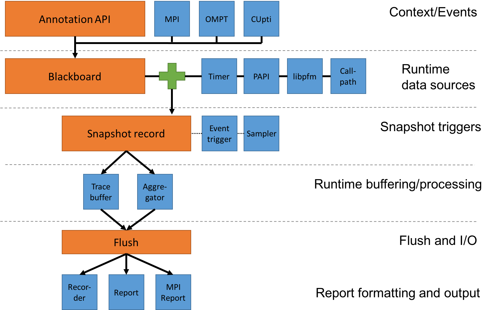

Architecture and workflow
================================

Caliper's highly modular architecture allows for a wide range of use
cases. For example, it can be used as a library to access application
context information from third-party tools, or it can be configured as
a stand-alone performance data recorder.

To use Caliper as a performance profiler or trace recorder, we need to
set up a data recording pipeline by enabling appropriate services on
each pipeline stage. The following figure illustrates the recording
pipeline:

            
    Caliper components and the data recording pipeline. The orange boxes
    are core components of the Caliper runtime library, the blue boxes
    are services.

Caliper services can be used in any combination. However, to produce
any output, at least one component must be active in each stage of the
recording pipeline.

To activate services, add them to the ``CALI_SERVICES_ENABLE``
configuration variable. The following example activates the event,
trace, timestamp, and recorder services to create an event trace with
timing information for annotated regions (this is the setup of the
pre-defined ``serial-trace`` configuration profile)::

  $ export CALI_SERVICES_ENABLE=event,recorder,timestamp,trace

Caliper warns if the configuration is missing a processing pipeline
stage while others are active::

  $ CALI_SERVICES_ENABLE=event,timestamp,trace ./examples/apps/cali-basic-annotations
  == CALIPER: Config check: Warning: snapshot buffer service "trace" requires offline output services, but none are active.
       Add "recorder", "report", "sos" or "mpireport" to CALI_SERVICES_ENABLE to generate Caliper output.

The following sections discuss the pipeline stages in detail.

Context Information and Event Hooks
----------------------------------------

Context information is the key:value data provided by Caliper's
annotation API. For example, an application can mark a section of code
with the ``CALI_MARK_BEGIN`` and ``CALI_MARK_END`` macros, or export
any application-specific information that may be relevant for
performance analysis in key:value form with, e.g., ``cali_set_int``.

Context information collection is active for any target program that
contains Caliper annotations and does not need to be configured
explicitly. There are also services that provide additional
context information through the annotation API, for example ``mpi``
(marks MPI functions), ``ompt`` (marks OpenMP regions using the OpenMP
tools interface), or ``cupti`` (marks CUDA runtime and driver API
calls).

In addition to providing context information, the API calls also serve
as hooks for Caliper-internal callbacks. These can be used to trigger
snapshots (see below) or connect Caliper annotations to a third-party
instrumentation API.

Runtime Data Sources
----------------------------------------

Runtime data sources provide the context and performance data that
Caliper records. The primary data source is the *blackboard*, which
contains all information provided by the annotation API. Context
information stays on the blackboard until it is explicitly cleared or
overwritten (generally, a *begin* annotation call will put context
information on the blackboard, and the corresponding *end* call will
clear it). Hence, the blackboard always contains the current
application context as defined by annotation API. The blackboard is
always active.

Aside from the blackboard, a number of services provide additional
performance or program context data (e.g., timer, PAPI hardware
counters, Linux perf events, and callpath). These are not active by
default and must be explicitly activated if needed.

Note that enabling runtime data sources only makes them accessible:
actual data collection happens through *snapshots*.

Snapshots
----------------------------------------

Snapshots are Caliper's mechanism to make performance measurements and
collect data. Specifically, a snapshot collects data from all active
runtime data sources and creates a snapshot record. The snapshot
record thus contains the blackboard contents (with the program context
information at the moment the snapshot was taken), along with any data
provided by the active runtime data source services (such as
timestamps or hardware counter information).

Snapshots can be triggered explicitly through the Caliper API, or by a
snapshot trigger service. The two major snapshot trigger services in
Caliper are :ref:`event <event-service>` and :ref:`sampler
<sampler-service>` (some other services, such as :ref:`libpfm
<libpfm-service>`, can also trigger snapshots). The event service
triggers a snapshot on each annotation *begin*, *set*, or *end*
event. This allows us to create event-based traces and profiles,
collecting exact statistics and performance measurements for annotated
code regions. The sampler service triggers snapshots periodically with
a configurable frequency. This asynchronous data collection mode is
less exact (we may miss some annotated code regions if they are very
short), but may incur less overhead. Moreover, in combination with
call stack unwinding, sampling can provide basic information about
code regions that have not been annotated. Event and sampled snapshot
triggers can be active at the same time.

Snapshot Buffering/Processing
----------------------------------------

The snapshot processing stage defines what to do with snapshot records
at runtime. Caliper provides two options: tracing and aggregation. The
:ref:`trace <trace-service>` service simply stores each snapshot record in an in-memory
buffer. The :ref:`aggregate <aggregate-service>` service performs in-situ aggregation, where
only aggregate performance data is kept for different program contexts
(e.g., the total runtime spent in each function). This can greatly
reduce the amount of data that needs to be kept, especially for
long-running, iterative programs.

Flush and Snapshot Post-Processing
----------------------------------------

A flush will push the trace buffer and/or aggregation database
contents into the reporting and I/O stage. Flushing can be triggered
explicitly through Caliper's API. Caliper will automatically trigger a
flush at program exit.

While the flush itself does not require extra configuration at
runtime, we can add snapshot post-processing services in this
stage. Notably, the :ref:`symbollookup <symbollookup-service>` service will look up source file,
line number, and function name information from binary program
addresses provided by e.g. the :ref:`callpath <callpath-service>` or :ref:`sampler <sampler-service>` service.

Reporting and I/O
----------------------------------------

The final pipeline stage formats and writes the collected
records. There are multiple options here.

The :ref:`recorder <recorder-service>` service writes records into Caliper-specific
``.cali`` format files (one per process), which can be examined
off-line with the ``cali-query`` tool.  The :ref:`report <report-service>` service can
filter, aggregate, and sort output records, and produce JSON output or
human-readable reports in table or hierarchical form. The reports can
be written into files or to standard output. As with ``recorder``,
reports will be written per process.  Finally, the :ref:`mpireport <mpireport-service>`
service aggregates or gathers output records from all ranks in an MPI
program, and writes a single output report. Like ``report``, it can
produce JSON or human-readable output as well as ``.cali`` files.
